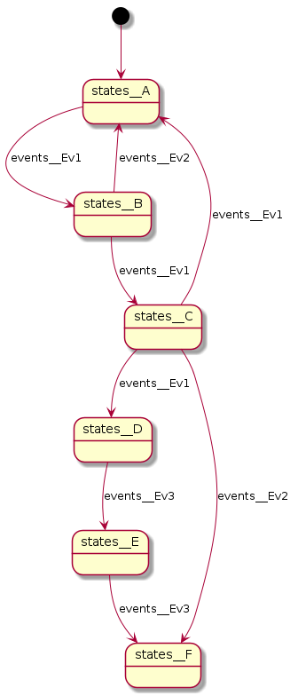
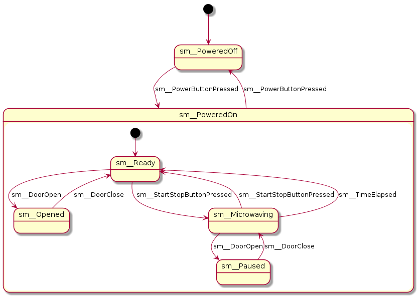
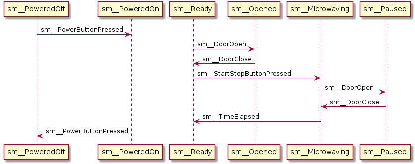

# Intro

This is my second take on C++ state machine implementation. My first attempt can be found [here](https://github.com/lukaszgemborowski/fsmpp).
The main goals of the implementation are:

1. No dynamic allocations
2. Sub-state support (in contrast to first implementation)
3. Type safety
4. Limited stdlib dependencies (in theory easier to port on embedded platforms)

## Requirements

Currently only C++17 capable compiler is required with some part of standard library: type_traits, variant and optional.

# Overview

You can start with a more [complex example](examples/plantuml_microwave.cxx)
or/and read through below introduction section.

## State

State is a class derived from fsmpp2::state<> template.

```cpp
struct A_State : fsmpp2::state<> {};
```

A state class instance is created when State Machine enters that state and is destructed when it leaves.
This concept greatly increase imporatance and usage of RAII idiom. Eg. you can hold a lock or open file while in state and rely on a fact that it will be
destructed when SM leaves that state. State handle events by using overloaded handle() method accepting particular (event) type.

```cpp
struct A_State : fsmpp2::state<> {
  auto handle(AnEvent const&) {
    return handled();
  }
};
```

**IMPORTANT** states are not heap-allocated, state machine statically allocates enough storage (byte array) and reuse that storage using placement new operator.

## State context

While states are short living objects and the user have little to no control over how they are managed it is possible to pass a custom object reference (Context)
to each state's constructor while it's created. Context type is defined while declaring state machine.

```cpp
struct CustomContext {};
struct A_State : fsmpp2::state<> {
  A_State(CustomContext &) {}
}
```

It is important to note, that every state in state machine have to use exactly the same type of context type. If it's not used in particular state,
user may provide a constructor that does not accept it as its argument.

```cpp
struct A_State : fsmpp2::state<> {
  A_State() = default; // still valid, this state does not reference a global context
}
```

### Context declaration

To pass a context down to state machine state you need to declare it in state_machine template. There are two ways of doing that, explicitly parametrize the template:

```cpp
using States = fsmpp2::states<StateA, StateB>;
using Events = fsmpp2::events<Ev1>;

Context ctx;
fsmpp2::state_machine<States, Events, Context> sm{ctx};

// or, to instantiate Context within state_machine template itself, omit the reference argument

fsmpp2::state_machine<States, Events, Context> sm;
```

or rely on CTAD:

```cpp
using States = fsmpp2::states<StateA, StateB>;
using Events = fsmpp2::events<Ev1>;

Context ctx;
fsmpp2::state_machine sm{States{}, Events{}, ctx};
```

### Multiple contexts

In case you need different type of contexts in different states you can declare a set of contexts:

```cpp
struct CtxA { bool value = false; };
struct CtxB { bool value = false; };

struct CtxStateB : fsmpp2::state<>
{
    CtxStateB(CtxB &ctx) {
        ctx.value = true;
    }
};

struct CtxStateA : fsmpp2::state<>
{
    CtxStateA(CtxA &ctx) {
        ctx.value = true;
    }

    auto handle(Ev1) { return transition<CtxStateB>(); }
};

CtxA ctx_a;
CtxB ctx_b;

fsmpp2::state_machine sm {
    fsmpp2::states<CtxStateA, CtxStateB>{},
    fsmpp2::events<Ev1>{},
    fsmpp2::contexts{ctx_a, ctx_b}
};
```

## State machine

"State machine" is simply a set of states, events and a context

```cpp
struct StateA;
struct StateB;
struct StateC;

struct Ev1;
struct Ev2;

struct CommonContext;

using States = fsmpp2::states<StateA, StateB, StateC>;
using Events = fsmpp2::events<Ev1, Ev2>;

CommonContext ctx;
fsmpp2::state_machine<States, Events, CommonContext> sm{ctx};
```

by default, SM enters the first state on the list, in this case `StateA`.

## Event passing

Event passing is done by calling handle() method on SM object:

```cpp
fsmpp2::state_machine<...> sm;
sm.dispatch(AnEvent{});
```

## State transitions

In order to move from one state to another a state handle() method needs to indicate that by returing a special value, the simplest case is:

```cpp
struct StateA : fsmpp2::state<> {
  auto handle(AnEvent const&) const {
    return transition<StateB>();
  }
};
// ...
fsmpp2::state_machine<fsmpp2::states<StateA, StateB, StateC>, fsmpp2::events<AnEvent>, Context> sm;
sm.dispatch(AnEvent{}); // transits from StateA to StateB
```

If there are multiple `return` paths, return value needs to be explicitly stated (as there's no way to auto-deduce it).

```cpp
struct StateA : fsmpp2::state<> {
  auto handle(AnEvent const& e) const -> fsmpp2::transitions<StateB, StateC> {
    if (e.some_value == 42)
      return transition<StateB>();
    else if (e.some_value == 3)
      return transition<StateC>();
    else
      return handled();
  }
};
// ...
fsmpp2::state_machine<fsmpp2::states<StateA, StateB, StateC>, fsmpp2::events<AnEvent>, Context> sm;
sm.dispatch(AnEvent{3}); // transits from StateA to StateC
```

for the sake of clarity you may opt to declare your event handlers as

```cpp
struct StateA : fsmpp2::state<> {
  auto handle(EventA const&) -> fsmpp2::transitions<>;
  auto handle(EventB const&) -> fsmpp2::transitions<StateB>;
  auto handle(EventC const&) -> fsmpp2::transitions<StateC>;
  auto handle(EventD const&) -> fsmpp2::transitions<StateB, StateC, StateD>;
};
```
so it's clerly visible in the state class interface which event can lead to what transition.

## Nested states

The library supports state hierarchy but this sections is "To be described". For more information see [an example](examples/plantuml_microwave.cxx).

## PlantUML diagrams

There's experimental support for PlantUML state diagrams (currently supported only when compiled with GCC). There are two type of diagrams that can be
created with fsmpp2:

1. state diagram
2. (runtime) sequence diagram

### State diagrams

Having a state set and event set the `fsmpp2::plantuml::print_state_diagram<States, Events>(std::cout);` function is able to output PlantUML source code for diagram generation to `std::ostream`, eg:

```cpp
namespace events
{

struct Ev1 : fsmpp2::event {};
struct Ev2 : fsmpp2::event {};
struct Ev3 : fsmpp2::event {};

} // namespace events

namespace states
{

struct A;
struct B;
struct C;
struct D;
struct E;
struct F;

struct A : fsmpp2::state<>
{
    auto handle(events::Ev1 const&) -> fsmpp2::transitions<B>;
};

struct B : fsmpp2::state<>
{
    auto handle(events::Ev1 const&) -> fsmpp2::transitions<C>;
    auto handle(events::Ev2 const&) -> fsmpp2::transitions<A>;
};

struct C : fsmpp2::state<>
{
    auto handle(events::Ev1 const&) -> fsmpp2::transitions<A, D>;
    auto handle(events::Ev2 const&) -> fsmpp2::transitions<F>;
};

struct D : fsmpp2::state<>
{
    auto handle(events::Ev3 const&) -> fsmpp2::transitions<E>;
};

struct E : fsmpp2::state<>
{
    auto handle(events::Ev3 const&) -> fsmpp2::transitions<F>;
};

struct F : fsmpp2::state<> {};

} // namespace states

int main()
{
    using States = fsmpp2::states<states::A, states::B, states::C, states::D, states::E, states::F>;
    using Events = fsmpp2::events<events::Ev1, events::Ev2, events::Ev3>;
    
    fsmpp2::plantuml::print_state_diagram<States, Events>(std::cout);
}
```

when run and parsed by plantuml produce:



Another one, previously linked [microwave example](examples/plantuml_microwave.cxx) auto-generated example:



This does not require instantiation of the state machine object therefore can be easily factored out to a separate function or target (eg. CI updating state
diagrams every build).

### Sequence diagrams

This is a combination of Tracer functionality (basically a trace logger following state machine execution in runtime) with a specialized type of formatting.
It can provide kind of a log (state transitions, events) in a form of sequence diagram. It is not strictly a "specification" type of a diagram but can be
useful for debugging or generating diagrams out of unit tests.

```cpp
sm::ContextData ctx;
std::ofstream ofs{"sequence.txt"};
fsmpp2::state_machine sm{States{}, Events{}, ctx, fsmpp2::plantuml::seq_diagrm_trace{ofs}};

// run a scenarion
sm.tracer().begin();
sm.dispatch(...);
...
sm.tracer().end();
```



# Licence

GPL-3.0 License, for details see [LICENSE file](LICENSE).
